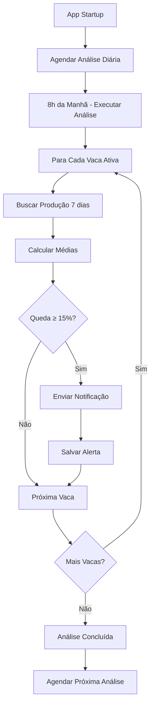

# 🔔 Sistema de Análise e Alertas de Produção de Leite

## 📋 Visão Geral

O sistema de análise de produção monitora automaticamente a produção de leite das vacas e envia notificações quando detecta quedas significativas na produção, ajudando o fazendeiro a tomar ações preventivas rapidamente.

## 🚀 Funcionalidades

### ✅ Análise Automática
- **Período analisado**: Últimos 7 dias de produção
- **Limite de queda**: 15% ou mais para gerar alerta
- **Produção mínima**: 5L (vacas com produção menor são ignoradas)
- **Análise programada**: Executada diariamente às 8h da manhã

### 🔔 Notificações Inteligentes
- **Notificação imediata**: Quando queda é detectada
- **Detalhes inclusos**: Nome da vaca, percentual de queda, produção anterior vs atual
- **Histórico**: Todos os alertas são salvos no Firestore

### 📊 Interface Intuitiva
- **Card na Dashboard**: Acesso rápido para executar análise manual
- **Tela de Alertas**: Visualização completa dos alertas pendentes
- **Ações rápidas**: Marcar como visualizado, ver detalhes da vaca

## 🎯 Como Usar

### 1. **Acesso pela Dashboard**
```
Dashboard → Card "Análise Produção" → Botão "Analisar"
```
- Executa análise instantânea de todas as vacas
- Mostra confirmação quando concluída

### 2. **Visualizar Alertas**
```
Dashboard → Card "Análise Produção" → Toque no card → Tela de Alertas
```
- Lista todos os alertas pendentes
- Mostra detalhes da queda de produção
- Opções para marcar como visualizado

### 3. **Análise Automática**
- Configurada automaticamente no startup do app
- Executa todos os dias às 8h
- Envia notificação com resultados

## ⚙️ Configuração Técnica

### Parâmetros Configuráveis
```dart
static const int _daysToAnalyze = 7; // Dias para análise
static const double _decreaseThreshold = 0.15; // 15% de queda
static const double _minProductionThreshold = 5.0; // Mínimo 5L
```

### Estrutura de Dados - Alertas
```json
{
  "vacaId": "string",
  "vacaNome": "string", 
  "dataAlerta": "timestamp",
  "producaoRecente": "number",
  "producaoAnterior": "number", 
  "percentualQueda": "number",
  "diasAnalisados": "number",
  "status": "pendente|visualizado|resolvido"
}
```

## 📈 Algoritmo de Análise

### 1. **Coleta de Dados**
- Busca registros de produção dos últimos 7 dias
- Agrupa por dia e calcula médias diárias
- Filtra vacas com dados insuficientes (< 3 dias)

### 2. **Comparação Temporal**
- Divide período em duas metades (recente vs anterior)
- Calcula média de produção para cada metade
- Compara para detectar tendência de queda

### 3. **Detecção de Alertas**
- Calcula percentual de queda: `(anterior - recente) / anterior`
- Gera alerta se queda ≥ 15%
- Ignora vacas com produção base muito baixa (< 5L)

### 4. **Ações Automáticas**
- Envia notificação push instantânea
- Salva alerta no Firestore para histórico
- Programa próxima análise automática

## 🎨 Interface de Usuário

### Dashboard Card
- **Ícone**: Analytics (vermelho)
- **Título**: "Análise Produção"
- **Ação**: Botão "Analisar" para execução manual

### Tela de Alertas
- **Header**: Contador de alertas pendentes
- **Cards**: Um por alerta com:
  - Nome da vaca e percentual de queda
  - Produção anterior vs recente
  - Data do alerta e dias analisados
  - Botões: "Ver Detalhes" e "Histórico"
- **Ações**: Marcar como visualizado, executar nova análise

## 🔧 Manutenção

### Logs
- Todas as operações são logadas via `AppLogger`
- Níveis: Info (análises), Warning (quedas), Error (falhas)

### Performance
- Análise otimizada por vaca individual
- Uso de batch queries no Firestore
- Cache de resultados durante execução

### Monitoramento
- Alertas não visualizados ficam marcados como "pendente"
- Histórico completo de todas as análises
- Métricas de desempenho via logs

## 📱 Notificações

### Configuração
- Canal: "Alertas de Produção"
- Prioridade: Alta
- Som: Ativado
- Badge: Ativado

### Payload
```
production_alert_[vacaId] // Para alertas específicos
auto_analysis // Para análise automática
```

## 🛡️ Tratamento de Erros

### Cenários Cobertos
- Vaca sem registros de produção
- Dados insuficientes para análise
- Falhas na conexão com Firestore
- Problemas na criação de notificações

### Recuperação
- Logs detalhados para debugging
- Continuação da análise mesmo com falhas individuais
- Feedback visual para o usuário

## 🔄 Fluxo Completo



## 🎯 Próximas Melhorias

- [ ] Integração com detalhes de cada vaca
- [ ] Gráficos de tendência de produção
- [ ] Relatórios de alertas por período
- [ ] Configuração de limites personalizados
- [ ] Análise de padrões sazonais
- [ ] Sugestões de ações corretivas
